# Safeguarding Project 
## Project Overview 
This is a basic website to demonstrate some key html and css skills. The topic is safeguarding and the website is designed with a simple colour palette so as to not distract from the serious topic. 

The website has two pages:
1. The main home page with the majority of the information in the sections About, Signs, Action, and Contact
2. A contact page with a form to submit information 

## Features
### Navigation Bar 
A responsive navigation bar that is consistent on both pages. The logo on the left hand side refreshes the page and will take you back to the home page, whilst the links on the right correspond to specific sections on the main page. 

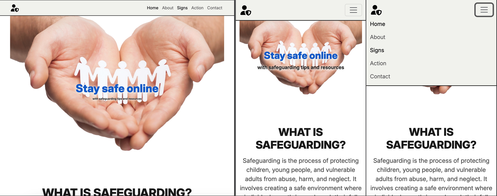

### Home Page 
The picture that welcomes the users to the site is simple with one sentence overlayed on top to introduces the topic in an efficient manner. 

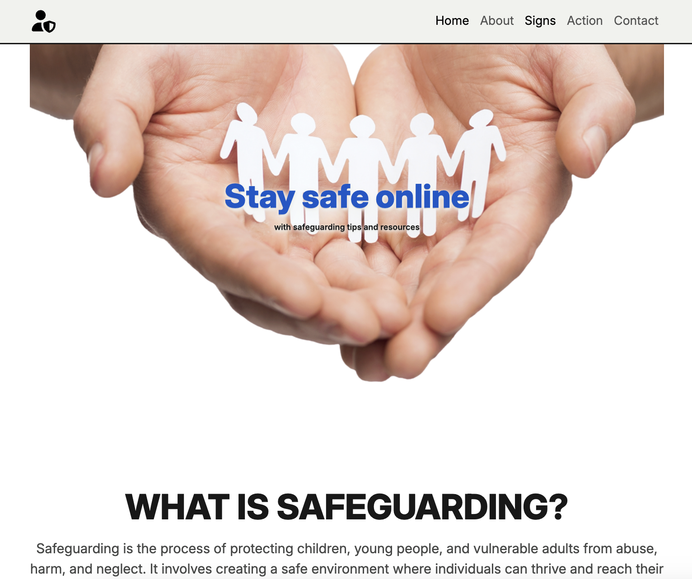

### About 
The first section explains the topic of the website to ensure that users understand what the issue is in a clear and concise manner. 
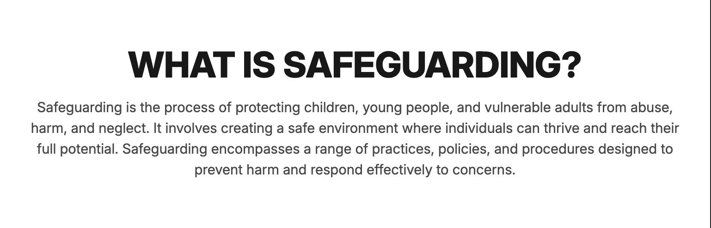

### Signs 
The warning signs section includes an accordion that can be opened to learn more about each sign without overwhelming the user with too much information at first glance. This also ensures that only the most important information is visible and will hopefully stick in the users mind. 
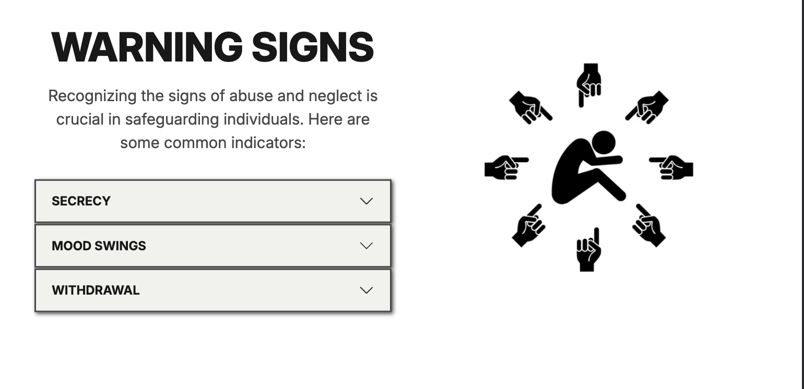

### Action 
The action section has cards that display the key steps needed to respond when a vulnerable person is in danger. The pictures are a visual reference to the key steps to help have a quick association for users. 
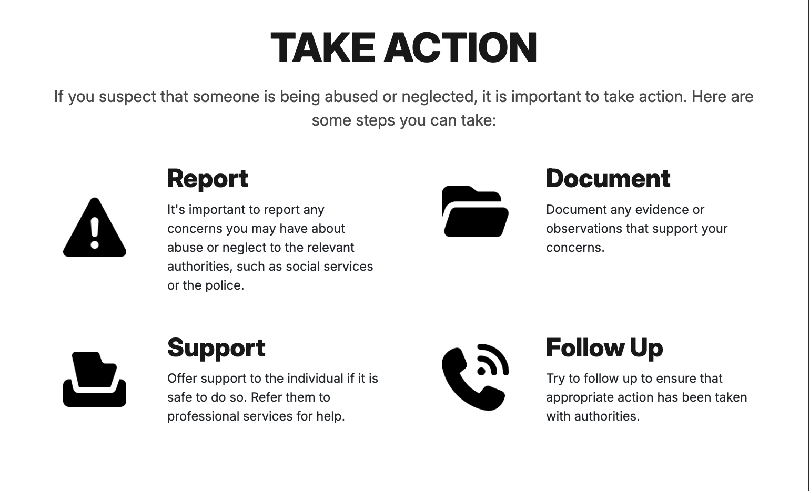

### Contact
The contact section shows how users can get in contact with the site owner with an Email button that will link to the contact form page. 
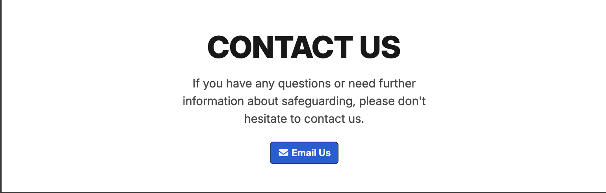

### Contact Page Form
The contact form page has an easy to use form that allows users to get in touch. The form has required features so that the users can only submit the form when all of the key information is filled. 
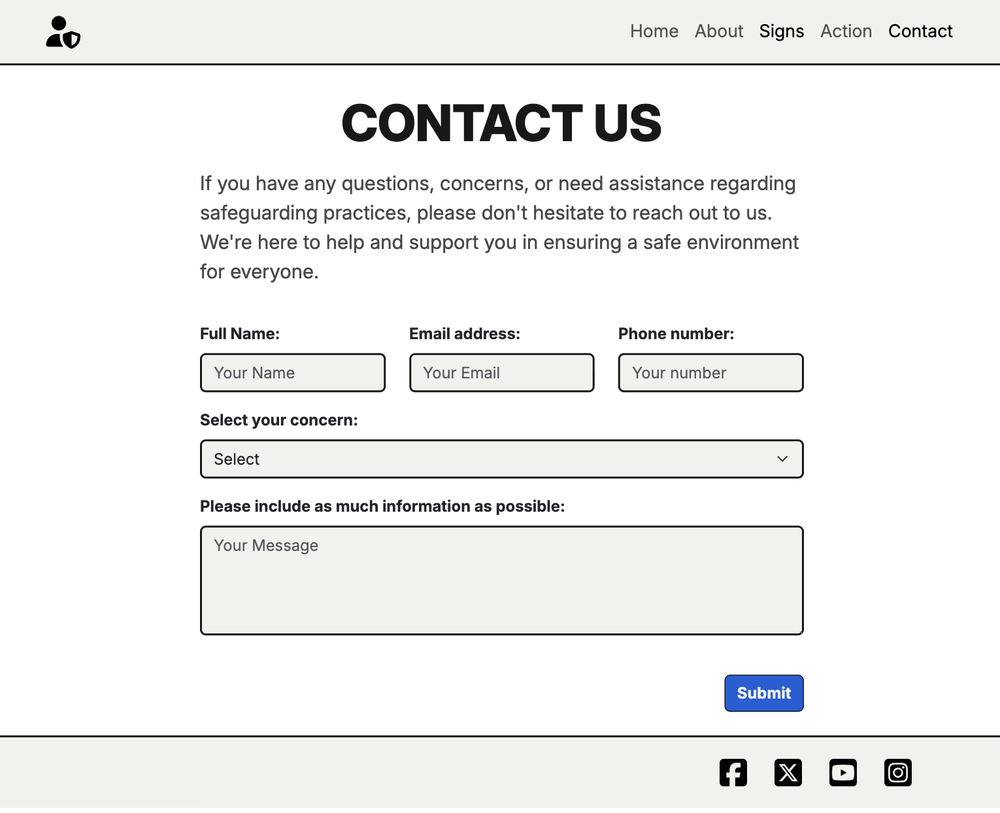

### Contact Page Success Page 
The user will be linked to this page when all of the fields of the form are filled to reassure users that their form has been received by the site owner.
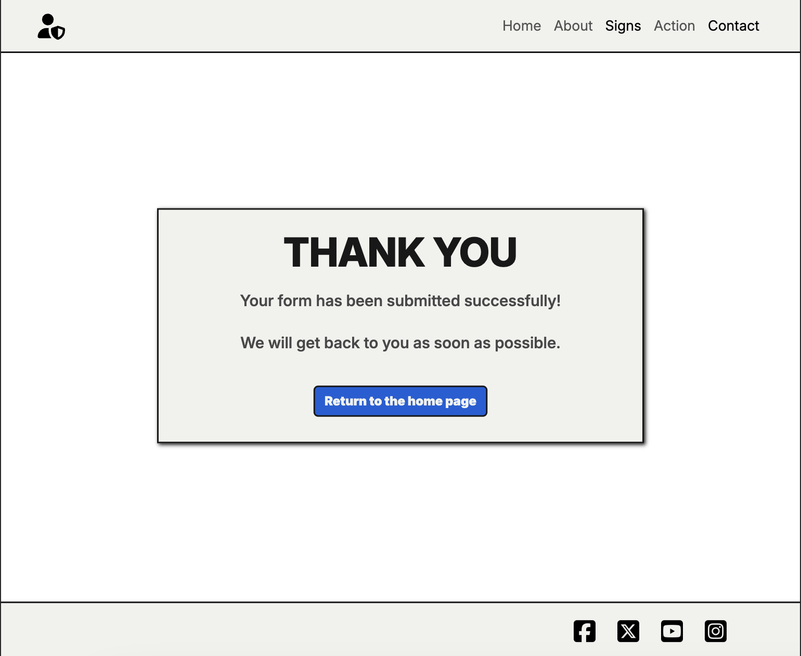

### Footer 
A simple footer with social icons that link to the corresponding websites and is consistent on all pages. 

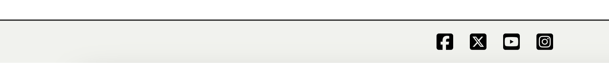

## Additional Features 
- **Fully responsive layout** - the site works well on desktop, tablet, and mobile devices 
- **Accessible** - the site has been run through an accessibility checker to ensure that is easy to read and that all alt text is included so that there will be no problems with screen readers

## Wireframes 
The layout and structure was planned using balsamiq wireframes. This software allowed me to brainstorm how the website features will look on different screen sizes. The wireframes were a useful launchpad for the initial layout. 

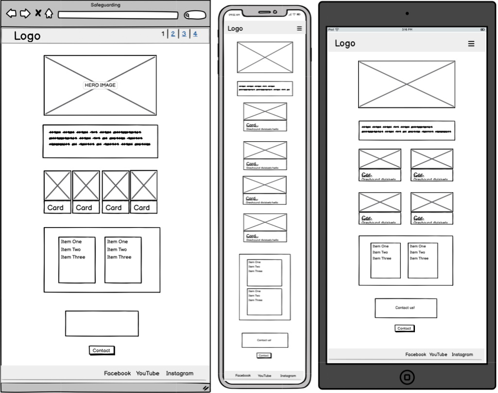

## Testing 
The website was tested on various site checkers to ensure the reliability of the features. 

1. HTML checker - passed on all pages
2. CSS checker - passed 
3. Lighthouse - optimal results
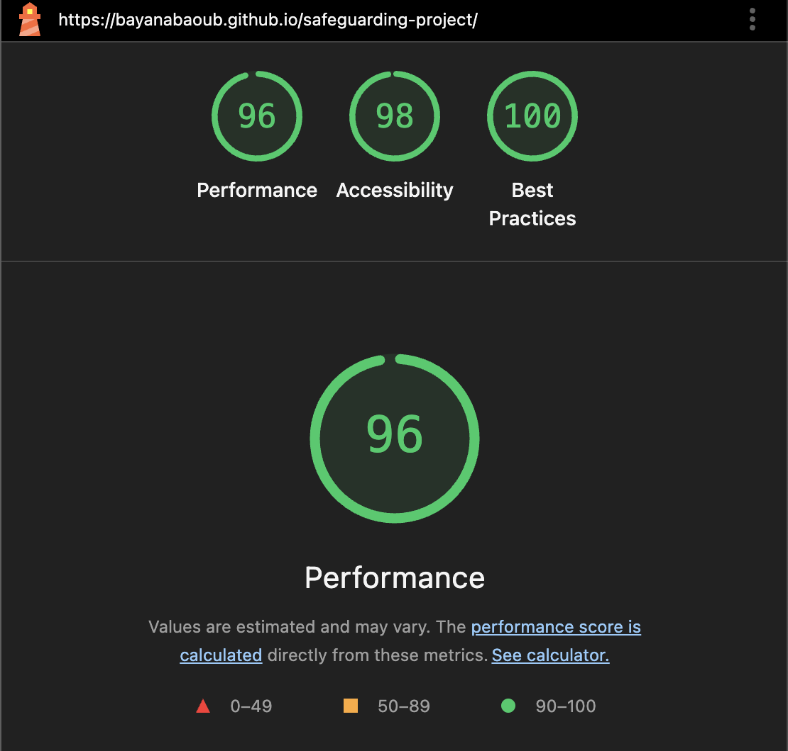

## Issues 
Instead of creating custom class selectors for the action section, I attempted to use the original selectors from boostrap but attempted to make them as specific as possible. This was not an efficient way to write the styling as it was confusing and sometimes overriden by other class selctors within other sections of the site. I was able to resolve this by creating a custom card-icon class with which I could apply specific styling without fear of misapplication.

## Deployment
The project was deployed via GitHub Pages.

## Credit 
- Bootsrap v.5 
- Previous walkthrough projects 
- CoPilot 
- FontAwesome
- Google Images
- Coolers